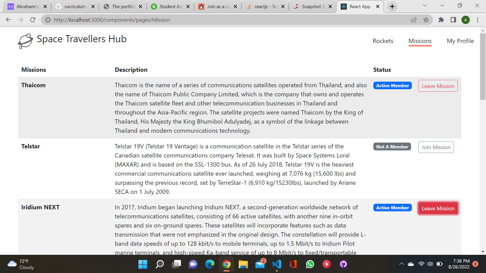
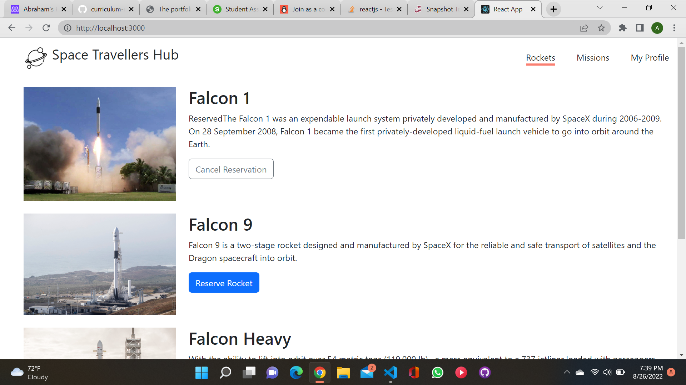
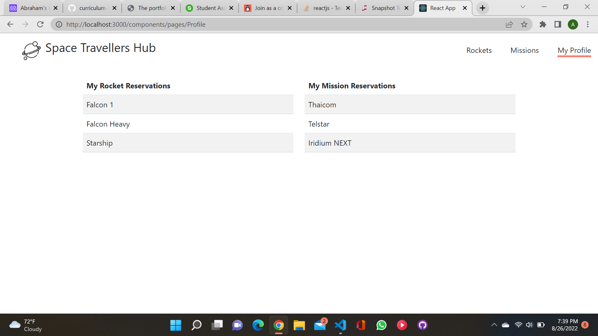

## # space-travellers

> This application works with real live data from the SpaceX API. It was build for a company that provides commercial and scientific space travel services. It allows users to book rockets and join selected space missions.

## Built With

- HTML

- Boostrap

- JavaScript

- React JS

- React Testing library

- Lighthouse (An open-source, automated tool for improving the quality of web pages. It has audits for performance, accessibility, progressive web apps, SEO and more).

- Webhint (A customizable linting tool that helps you improve your site's accessibility, speed, cross-browser compatibility, and more by checking your code for best practices and common errors).

- Stylelint (A mighty, modern linter that helps you avoid errors and enforce conventions in your styles).

- ESlint (A mighty, modern linter that helps you avoid errors and enforce conventions in JavaScript codes)

## Project Screenshots

## Getting Started

To get a local copy up and running follow these simple example steps.

- copy [this link](https://github.com/Ibizugbe/space-travellers).
- get the directory that you want to clone the repository.
- open the command prompt in this directory.
- write git clone git@github.com:Ibizugbe/space-travellers.git
- go to the repository folder in your command prompt cd Space-travellers
- use npm install to install the dependencies.
- use npm start to start live server.

## Prerequisites

- Have a working and updated browser
- Have a local version control like git install on your computer
- Have an account and sign in on GitHub, as online/remote version control system
- Basic knowledge in JS and React JS

### Setup

- Clone the git repo using this command: `git cloneh ttps://github.com/Ibizugbe/space-travellers`

### Run tests

- `npx stylelint "/*.{css,scss}"**`: To test css code
- `npx eslint .` : To test Eslint Report

### To test the application

- `npm install --save-dev jest`
- `npm test`

## Live Demo

- [Visit here](https://space-travellers-97.netlify.app/)

## Authors

👤 **Abraham Ibizugbe**

- [Ibizugbe](https://github.com/Ibizugbe)
- [abrahamibizugbe](https://twitter.com/AbrahamIbizugbe)
- [Abraham Ibizugbe](https://www.linkedin.com/in/abrahamibizugbe/)

👤 **Rose Okpe**

- [GitHub](https://github.com/roseokpe)
- [Twitter](https://twitter.com/roseokpe)
- [LinkedIn](https://www.linkedin.com/in/rose-okpe-0334b5177/)

## Contributing

Contributions, issues, and feature requests are welcome!

Feel free to check the issues page.

## Show your support

Give a star if you like this project!

## Acknowledgments

- Microverse linters
- Coding partners

## 📝 License

This project is [MIT](./LICENSE) licensed.
